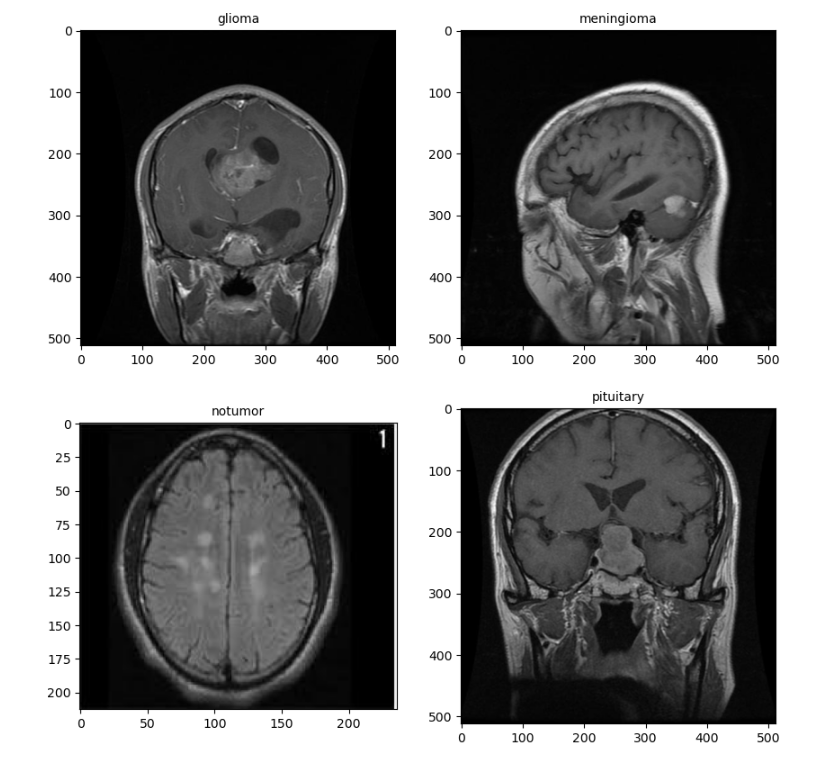
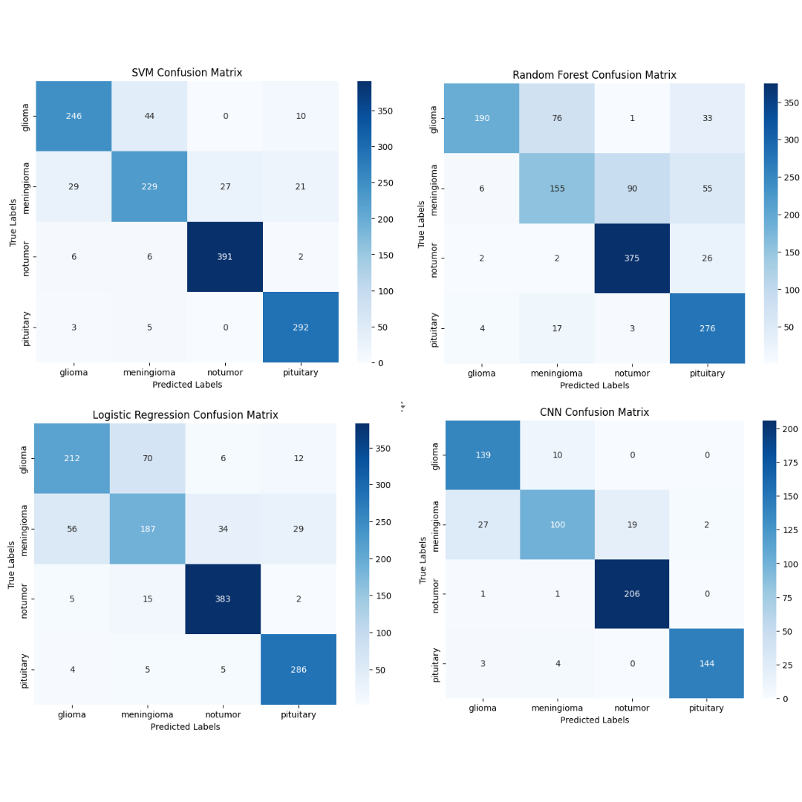

 

 # 🧠 NeuroDetect 🧠
 ### An Automated Brain Tumour Detection & Classification 

    
## Project Overview
Brain tumours are common but challenging to detect, particularly in the early stages. Early detection and classification are crucial, helping medical professionals select effective treatment options and ultimately save lives. Distinguishing between tumour types—such as glioma, meningioma, and pituitary tumours—can be difficult even for skilled radiologists and surgeons. What if we could assist medical practitioners in identifying tumours faster, increasing patient turnaround and reducing costs? 

This project is inspired by that question. **Using machine learning, how can we identify tumours in MRI scans to improve early detection, prevent further complications, and accelerate treatment planning?**

(<a href="#readme-top">back to top</a>)

## Project Goal
The primary goal of this project is to build a machine learning model that can  **accurately detect the presence of a tumour in an MRI image and identify the tumour type.**  This model aims to enhance the efficiency and precision of brain tumour diagnosis, supporting radiologists, surgeons, and researchers by:

-   Reduce diagnostic times
-   Reduce time for treatment planning
-   Increasing patient turnaround
-   Minimizing costs linked to misdiagnoses and incorrect treatments

(<a href="#readme-top">back to top</a>)

## The Data
For this project, we will be using a mix of image data from various data sources all bundled into one folder. The dataset is a combination of three datasets: figshare, SARTAJ dataset and the Br35H dataset. The dataset was combined and collected from __[Kaggle.](https://www.kaggle.com/datasets/masoudnickparvar/brain-tumor-mri-dataset)__ The dataset contains 7023 MRI images of brain tumours classified into glioma, meningioma, pituitary and non-tumor. Images are already sorted and arranged to train and test folders within the **Data** directory.

(<a href="#readme-top">back to top</a>)

## Exploratory Data Analysis (EDA)
Exploratory data analysis (EDA) was conducted to understand the distribution of the classes, image dimensions, and other patterns that may help in improving model accuracy. The images for each class was evenly disitrubuted which is important to ensure one class would not create a bias for the model. 

**Important:** During the EDA, we noticed that the dataset contains various image sizes and dimensions, not all images are the same size. The dataset also contains MRI scans taken from different angles and brain segments. This is key when it comes to preporcessing and modelling our data as it could cause problems for our model. We can see the different image size and angles taken below.

<h4 id="sample_image"> Sample Data Image </h4>

(<a href="#readme-top">back to top</a>)

## Preprocessing 
The data preprocessing was done in two stages: one for the Convolutional Neural Network (CNN) model and another for the non-deep learning models.

For the CNN Model:
1. **Image Import**: All MRI images were loaded and preprocessed to ensure consistency across the dataset.
2. **Grayscale Conversion**: The images were converted to grayscale to reduce computational complexity while preserving relevant features.
3. **Resizing**: All images were resized to a uniform dimension to ensure consistency across the dataset, allowing them to be used in a deep learning model.
4. **Normalization**: The pixel values were normalized to fall within the range [0, 1], which helps improve model performance during training.
5. **One-Hot Encoding**: The tumor class labels (glioma, meningioma, pituitary, and no tumor) were one-hot encoded to facilitate multi-class classification.

For Non-Deep Learning Models:
1. **Image Import**: MRI images were loaded similarly to the CNN model.
2. **Grayscale Conversion & Resizing**: Like the CNN preprocessing, the images were converted to grayscale and resized for consistency.
3. **Flattening**: To make the images interpretable by non-deep learning models (such as Logistic Regression, SVM, and Random Forest), the images were flattened into a one-dimensional array. This transformation allows these models, which cannot inherently handle image data, to process the pixel data as input features.
4. **Feature Scaling**: The pixel values were normalized to fall between 0 and 1 to ensure the models perform optimally by avoiding large values that could dominate model learning. 

## Baseline Models
In this project, we used both deep learning and non-deep learning models for brain tumor classification. The models were trained to detect the presence of tumors and identify their types (glioma, meningioma, pituitary, or no tumor). The purpose of using both methods of modeling as a baseline is to understand how various models perform in image classification. The four main models that were trained are:

1. Logistic Regression
2. Support Vector Machine (SVM)
3. Random Forest
4. Convolutional Neural Network (CNN)

#### Baseline Model Results 

The results were the following for baseline accuracy:

| Model             | Train Accuracy | Test Accuracy |
|:-------------------:|:----------------:|:---------------:|
| Logistic Regression | 89.74%         | 81.46%        |
| Support Vector Machine (SVM) | 92.49%         | 88.33%        |
| Random Forest      | 83.96%         | 75.97%        |
| Convolutional Neural Network (CNN) | 95.95% | 90.69% |

The baseline accuracy results show that the Convolutional Neural Network (CNN) outperformed all other models, achieving a high training accuracy of 95.95% and a test accuracy of 90.69%. The Support Vector Machine (SVM) followed closely with a training accuracy of 92.49% and a test accuracy of 88.33%, indicating solid performance with less overfitting than Logistic Regression. The Random Forest model performed the worst, with a training accuracy of 83.96% and test accuracy of 75.97%, indicating significant overfitting and poor generalization.

The results were the following for recall scores:
| Model                         | No Tumor Recall | Pituitary Recall | Glioma Recall | Meningioma Recall |
|:-------------------------------:|:-----------------:|:------------------:|:---------------:|:-------------------:|
| Logistic Regression            | 95%             | 95%              | 71%           | 61%               |
| Support Vector Machine (SVM)   | 97%             | 97%              | 82%           | 75%               |
| Random Forest                  | 93%             | 92%              | 63%           | 51%               |
| Convolutional Neural Network (CNN) | 99% | 95% | 93% | 68% |

In terms of recall, CNN achieved the highest recall for "No Tumor" (99%) and performed well on "Glioma" (93%) but struggled with "Meningioma" (68%). SVM also performed well, especially on "No Tumor" (97%) and "Pituitary" (97%), and showed better results than Logistic Regression and CNN for "Meningioma" (75%). Random Forest had a very low recall for both "Glioma" (63%) and "Meningioma" (51%).  

<h4 id="confusion_matrix"> Confusion Matrix </h4>

The confusion matrix highlights the misclassification patterns of each model, with a consistent trend across all four baseline models: the "Meningioma" tumour class is frequently misclassified. This recurring issue underscores the need for further model refinement to improve the accurate identification of this challenging tumour type.

Overall, the CNN model emerged as the best-performing model (which is to be expected), while the Random Forest model was the worst. The most interesting about this is how well SVM performed for a non-deep learning model, to the point where it even performed better at recalling Meningioma compared to CNN. 

(<a href="#readme-top">back to top</a>)

## Model Improvement and Hyperparameter Tuning
After observing the performance of the baseline models, particularly the Convolutional Neural Network (CNN), we aimed to further enhance the model's accuracy, recall, and generalization ability. To achieve this, we developed two solutions:
1. An Advanced CNN model
2. A Transfer Learning model using ResNet50

To improve on the baseline CNN model, we designed an Advanced CNN architecture tailored to this specific dataset. The changes made are the following:

- **Increased Network Depth**: Added more convolutional layers to capture deeper hierarchical features of MRI images.
- **Batch Normalization**: Applied batch normalization after each convolutional layer to stabilize training and reduce internal covariate shift.
- **Dropout Layers**: Introduced dropout layers (rate = 0.4) to reduce overfitting.
- **Global Average Pooling**: Replaced flattening layers with Global Average Pooling (GAP) to reduce overfitting while maintaining interpretability.

We also explored ResNet50, a pre-trained deep learning model, to investigate whether transfer learning could yield better results than our custom Advanced CNN.

**First Approach:**
Initially, we froze all layers of the ResNet50 model and built additional layers on top. This approach, however, yielded poor results as the model failed to adapt to the domain-specific features of MRI images.

**Second Approach:**
To improve performance, we unfroze the last 20 layers of ResNet50, allowing these layers to train on the MRI dataset. This approach enabled the model to learn features that are specific to medical images, resulting in a noticeable improvement in classification accuracy.

#### Advance Model Results 
The results were the following for Advance Model accuracy:

| Model             | Train Accuracy | Test Accuracy |
|:-------------------:|:----------------:|:---------------:|
| Convolutional Advanced Neural Network | 98.76%         | 96.49%       |
| ResNet50 Model | 92.66% | 91.62% |

The results were the following for recall scores:
| Model                         | No Tumor Recall | Pituitary Recall | Glioma Recall | Meningioma Recall |
|:-------------------------------:|:-----------------:|:------------------:|:---------------:|:-------------------:|
| Convolutional Advanced Neural Network | 100% | 100% | 98% | 87% |
| ResNet50 Model | 100% | 96% | 81% | 86% |

The advanced CNN model achieved a test accuracy of 96.49% while the ResNet50 Model had an accuracy of 91.62%, indicating that both Advance models performed really well. The models excelled in predicting the 'pituitary' and 'no tumor' classes, achieving strong precision and recall scores of around 96-100%. Notably, the Advance CNN model showed significant improvement in detecting 'meningioma,' with its recall score increasing to 87% compared to 68% in the baseline model. The ResNet50 model performed quite well as well. Detecting 'meningioma,' yielded a recall score of 86%. The 'glioma' class also had a relatively decent recall score of 81%.

While ResNet50 improved classification speed and demonstrated high accuracy, it did not outperform the Advanced CNN model due to domain-specific differences between general image datasets (like ImageNet) and medical images (like MRI scans).

<h4 id=“advance_confusion_matrix”> Advance Model Confusion Matrix </h4>

The confusion matrix reveals the misclassification patterns of both models. Both models perform well in classifying "no tumor" and "pituitary" images. However, the Advanced CNN model outperforms the ResNet50 model overall. Interestingly, each model struggles with a different tumor class. The Advanced CNN model misclassified 16 "meningioma" images as "glioma," while the ResNet50 model misclassified 27 "glioma" images as "meningioma." This highlights the challenge both models face in distinguishing between these two tumor types.

<h4 id=“incorrect_classification”> CNN Advance Model Incorrect Classificatiox </h4>

Across all models, a consistent challenge was the misclassification of meningioma and glioma tumor classes. This issue arises because both tumor types exhibit large, visually prominent masses that the model struggles to differentiate. In many cases, meningioma images were misclassified as glioma and vice versa. This reflects a real-world challenge, as glioma and meningioma tumors often have similar shapes and sizes, making them difficult to distinguish even for medical professionals.

<h4 id=“grad_cam”> ResNet50 Grad-Cam</h4>

Applying Grad-CAM to our 'pituitary' test image, we can see that the model successfully identified the tumor's location and correctly predicted its type. The dark red region highlights the area where the model detected an anomaly, providing a visual representation of its focus during classification. This is a great sign, indicating our model is working and performing execeptional. 

(<a href="#readme-top">back to top</a>)

## Conclusion
In terms of overall performance, the Advanced CNN model emerged as the best model for image classification. It achieved a test accuracy of approximately 96% and delivered excellent recall scores across all classification groups. Below are the results for all the models:

| Model             | Train Accuracy | Test Accuracy |
|:-------------------:|:----------------:|:---------------:|
| Logistic Regression | 89.74%         | 81.46%        |
| Support Vector Machine (SVM) | 92.49%         | 88.33%        |
| Random Forest      | 83.96%         | 75.97%        |
| Convolutional Baseline Neural Network | 95.95% | 90.69% |
| Convolutional Advanced Neural Network | 98.76% | 96.49% |
| ResNet50 Model | 92.66% | 91.62% |

Now lets compare the recall scores for each classifcation for all the models.

| Model                         | No Tumor Recall | Pituitary Recall | Glioma Recall | Meningioma Recall |
|:-------------------------------:|:-----------------:|:------------------:|:---------------:|:-------------------:|
| Logistic Regression            | 95%             | 95%              | 71%           | 61%               |
| Support Vector Machine (SVM)   | 97%             | 97%              | 82%           | 75%               |
| Random Forest                  | 93%             | 92%              | 63%           | 51%               |
| Convolutional Baseline Neural Network | 99% | 95% | 93% | 68% |
| Convolutional Advanced Neural Network | 100% | 100% | 98% | 87% |
| ResNet50 Model | 100% | 96% | 81% | 86% |

After training and testing multiple models, our Advanced CNN model demonstrated the best overall performance and is ready for production.

**In conclusion, we successfully developed a robust model that can assist radiologists and medical professionals in detecting tumors and identifying tumor types at an early stage. This advancement has the potential to increase patient turnover, expedite treatment planning, and significantly accelerate diagnostic times. Our model is now ready to be productionalize for stakeholders to use.**

(<a href="#readme-top">back to top</a>)

## References
Cheng, Jun (2017). brain tumor dataset. figshare. Dataset. https://doi.org/10.6084/m9.figshare.1512427.v5

Msoud Nickparvar. (2021). Brain Tumor MRI Dataset [Data set]. Kaggle. https://doi.org/10.34740/KAGGLE/DSV/2645886

Sartaj Bhuvaji, Ankita Kadam, Prajakta Bhumkar, Sameer Dedge, and Swati Kanchan. (2020). Brain Tumor Classification (MRI) [Data set]. Kaggle. https://doi.org/10.34740/KAGGLE/DSV/1183165

Selvaraju, R. R., Cogswell, M., Das, A., Vedantam, R., Parikh, D., & Batra, D. (2019). Grad-cam: visual explanations from deep networks via gradient-based localization. International Journal of Computer Vision, 128(2), 336-359. https://doi.org/10.1007/s11263-019-01228-7

fchollet (2021) Grad-CAM Class Activation Visualization https://keras.io/examples/vision/grad_cam/
gkeechin (2021) VizGradCam https://github.com/gkeechin/vizgradcam

(<a href="#readme-top">back to top</a>)

